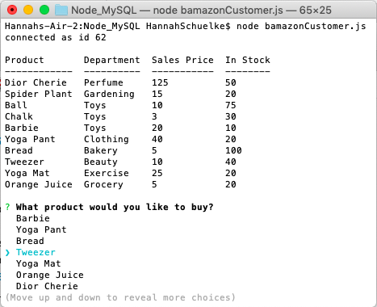
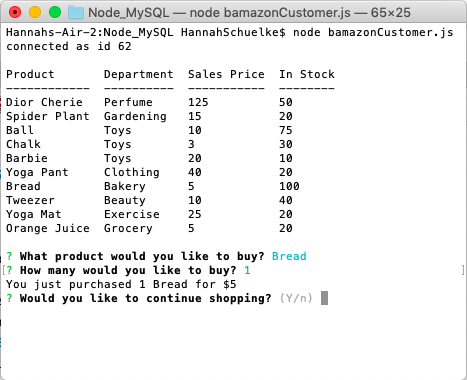

# B-Amazon

This app is an Amazon-like storefront: showing an inventory, taking in orders from customers, summing totals, asking you if you'd like to continue shopping, marking a depleting stock, denying your order of a product if you want a quantity out of stock, thanking you for shopping, and asking you to come back soon. 

A project requiring Javascript/JQuery/NodeJS/MySQL, this is assignment nine of UMN's Coding Bootcamp. 

### Prerequisites

To utilize this project, access my files via my Node_MySQL Github repository and save them to a single folder on your computer. From there, you must source your own MySQL password to put in a correlating .env file. Finally, from the same you must do NPM installs, on itself, for MySQL, and console.table to render the same effects in your terminal. After you follow these steps, my inventory should populate you terminal entering `node bamazonCustomer.js`. Your terminal will prompt you from there. 

### Installing

1. Direct yourself to the folder where you'd like to test my project. 
2. Do npm installs inside the same root folder from your terminal command line: `npm install` `npm install mysql` `npm install console.table`. 
3. Go to https://github.com/HannahSchuelke/Node_MySQL and clone or download my files into the same folder.
4. Make a .gitignore file and type `node_modules`, `.DS_Store`, and `.env` into it. 
5. Source your own MySQL password and insert that in your .env file. 
6. Open up your terminal and direct yourself to the folder where you have rooted my project. 
7. From here you may access my store by typing `node bamazonCustomer.js` into your terminal/bash command line (from the folder where you have rooted my the above said files). 

### How to use

After following step one through seven above, your terminal will first populate with a start menu. The table shows you which products are for sale, and the departments, prices, and quantities of those products. A prompt asks you which product you'd like to buy, and you may scroll through until you've made your choice.  

### Github repository

(https://github.com/HannahSchuelke/Node_MySQL)

### Built With

* [npm install](https://docs.npmjs.com/cli/install) - Installs package.json and node.modules that app depends on
* [mysql](https://www.npmjs.com/package/mysql) - Needed to access MySQL Workbench
* [inquirer](https://www.npmjs.com/package/inquirer) - Needed for prompts on command interface
* [console.table](https://www.npmjs.com/package/console.table) - Used to generate table's esthetics
* [dotenv](https://www.npmjs.com/package/dotenv) - Installed to load environment variables from my .env file into process.env

### Authors

* **Hannah Schuelke** - (https://github.com/HannahSchuelke)
