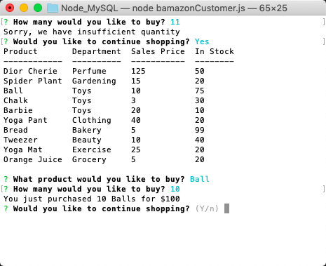

# B-Amazon

This app is an Amazon-like storefront: showing an inventory, taking in orders from customers, summing totals, asking if you'd like to continue shopping, marking a depleting stock, denying your order of a product if you want a quantity which is then out of stock, thanking you for shopping, and asking you to come back soon. 

A project requiring Javascript/JQuery/NodeJS/MySQL, this is assignment nine of UMN's Coding Bootcamp. 

### Prerequisites

To utilize this project, access my files via my Node_MySQL Github repository and save them to a single folder on your computer. From there, you must source your own MySQL password to put in a correlating .env file. From the same folder you must do NPM installs, on itself, for MySQL, and console.table to render the same effects in your terminal. You must also install MAMP and MySQL Workbench. After you follow these steps, my inventory should populate you terminal by entering `node bamazonCustomer.js`. Your terminal will prompt you from there. 

### Installing

1. Direct yourself to the folder where you'd like to test my project. 
2. Do npm installs inside the same root folder from your terminal command line: `npm install` `npm install mysql` `npm install console.table`. 
3. Go to https://github.com/HannahSchuelke/Node_MySQL and clone or download my files into the same folder on your computer.
4. Make a .gitignore file and type `node_modules`, `.DS_Store`, and `.env` into it. 
5. Source your own MySQL password and insert that in your .env file. 
6. Download MAMP at https://www.mamp.info/en/downloads/. After completed the app will open, and click to start the server. 
7. Download MySQL Workbench at https://dev.mysql.com/downloads/workbench/. 
8. From MySQL Workbench, click file > Open SQL Script... > and locate my amazon.sql file to open.
9. When opened in MySQL Workbench, click the farthest left lightening bolt icon, and the refresh button in the schemas tab. 
10. In MySQL Workbench still, you must repeat step eight and nine, but instead you will open my query.sql file. 
11. Open up your terminal and direct yourself to the folder where you have rooted my project. 
12. From here you may access my store by typing `node bamazonCustomer.js` into your terminal/bash command line (from the folder where you have rooted my files). 

### How to use

After following step one through 12 above, your terminal will first populate with a start menu. The table shows you which products are for sale, and the departments, prices, and quantities of those products. A prompt asks you which product you'd like to buy, and you may scroll through until you've made your choice.  

In these photos, you see that I scrolled past tweezers to settle on bread. When I say I'd like to purchase one bread, the app gives me a total and asks if I would like to continue shopping. I say yes.

At this time you can see that my bread inventory has updated, and I want to continue shopping. I want to buy a barbie but have a typo instead. I typed "oops", but luckily, B-Amazon will automatically clear my command line and give me another try at typing an integar. 

When I try to purchase 11 barbies, B-Amazon tells they have insufficient quantity and it does not fulfill the order. It then asks If I would like to continue shopping, and I say yes. 

Now I said I would like to purchase 10 balls. Still, the bread I wanted earlier is in my shopping cart, marked by adjusted inventory. B-Amazon makes my purchase request plural, gives me the total on the request, and then asks me if I'd like to continue shopping. I say no this time. 

Because I don't want to continue shopping, B-Amazon thanks me for shopping and asks me to come back soon. 

### Github repository

(https://github.com/HannahSchuelke/Node_MySQL)

### Built With

* [npm install](https://docs.npmjs.com/cli/install) - Installs package.json and node.modules that app depends on
* [inquirer](https://www.npmjs.com/package/inquirer) - Needed for prompts on command interface
* [console.table](https://www.npmjs.com/package/console.table) - Used to generate table's esthetics
* [dotenv](https://www.npmjs.com/package/dotenv) - Installed to load environment variables from my .env file into process.env
* [mysql](https://www.npmjs.com/package/mysql) - Needed to access MySQL Workbench with NodeJS
* [MySQL Workbench](https://dev.mysql.com/downloads/workbench/) - Needed to process client/customer requests
* [MAMP](https://www.mamp.info/en/downloads/) - Needed to operate MySQL Workbench

### Authors

* **Hannah Schuelke** - (https://github.com/HannahSchuelke)
